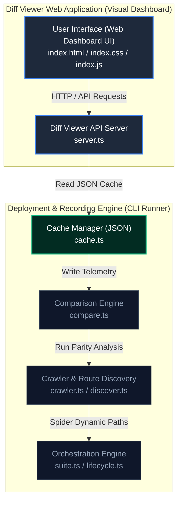

# App Hosting N-Way Matrix Comparison Tool

This is an experimental internal CLI tool built for the Firebase App Hosting team to dynamically verify the compatibility and performance of different infrastructure backends or application builds. 

It takes an array of configurations (variants) and automatically deploys them, discovering their routes, and rendering an interactive $O(N^2)$ Pair-wise Cartesian Matrix heatmap dashboard.

## Capabilities

1. **Standard CLI Fidelity**: Deployments are executed by automatically constructing a temporary `firebase.json` and programmatically calling the `firebase deploy` CLI execution path. This guarantees that test deployments faithfully mirror the actual customer experience (including Secrets, AutoInit Env Vars, and custom headers).
2. **Local vs Remote Build Verification**: Can deploy locally built bundles (e.g. `localBuild: true`) side-by-side with remote Cloud Build source zips.
3. **Automated IAM & Secrets Management**: Intelligently creates a single mock secret in Secret Manager for each distinct codebase path, mapping the IAM `secretAccessor` roles simultaneously to all backends generated from that codebase.
4. **Dynamic Spidering**: Automatically crawls Next.js / Angular apps recursively starting from `/` to discover hidden dynamic routes, alongside statically parsing `.next/prerender-manifest.json`.
5. **Interactive Visualization Dashboard**: Hosts an interactive split-view dashboard showcasing global parity heatmaps, dynamic filtering, code diffs, and exact header mismatches.

## Usage

1. Create a `matrix-test.json` file to define your test cases:

```json
[
  {
    "name": "Node Matrix Test",
    "variants": [
      {
        "id": "Local-Node24",
        "path": "../next-sample-1",
        "localBuild": true,
        "runtime": "nodejs24"
      },
      {
        "id": "Source-Node24",
        "path": "../next-sample-1",
        "localBuild": false,
        "runtime": "nodejs24"
      }
    ]
  }
]
```

2. Run the deployment and recording phase:

```bash
FIREBASE_CLI_EXPERIMENTS=apphosting firebase apphosting:compare-suite --project <your-project> --suite-config src/apphosting/compare/matrices/matrix-test.json --record-only
```

3. Spin up the visual dashboard to inspect the matrices and diffs:

```bash
FIREBASE_CLI_EXPERIMENTS=apphosting firebase apphosting:compare-suite --serve --port 3000
```


## System Architecture & Subsystem Delineation

The N-Way Matrix Comparison Tool is divided into two distinct subsystems to separate the CLI recording/deployment engine from the visual comparison dashboard (the Diff Viewer).





### 1. The Diff Viewer Web Application (Visual Dashboard)
This subsystem is responsible for hosting the interactive web interface, serving visualization assets, and exposing the matrix-calculation APIs.
*   **`src/apphosting/compare/public/`**: Contains the frontend single-page application:
    *   `index.html`: Layout structure, split panes, controls bar, and dialog anchors.
    *   `index.css`: Stylesheet, custom dark-mode slate theme, responsive grid cards, and transition overlays.
    *   `index.js`: Client-side logic, real-time matrix rendering using HSL interpolation, localStorage configuration persistence, inline table ignores, and dynamic filters.
*   **`src/apphosting/compare/server.ts`**: The lightweight Express API backend. It reads recorded JSON files from the cache directory, serves the static assets from the `public/` directory, and provides endpoints:
    *   `/api/recordings`: Lists all available cached test suite recordings.
    *   `/api/matrix`: Recalculates pairwise parity similarity scores dynamically.
    *   `/api/compare`: Performs exact body and header diffs between two selected variant recordings.
    *   `/api/render`: Proxies the recorded response bodies as live visual rendering previews.

### 2. The Deployment & Recording Engine (CLI Runner)
This subsystem orchestrates the lifecycle of deploying temporary slots, discovering routes, spidering endpoints, and persisting telemetry.
*   **`src/apphosting/compare/suite.ts`**: The main execution orchestrator for the CLI command. It processes test matrices, locks concurrency slots, and schedules deployment loops.
*   **`src/apphosting/compare/lifecycle.ts`**: Handles programmatic interactions with the Firebase CLI (`firebase deploy`) and cleanups.
*   **`src/apphosting/compare/discover.ts`**: Parses local build metadata (such as the Next.js pre-render manifest) to compile an initial target route list.
*   **`src/apphosting/compare/crawler.ts`**: A recursive spider crawler that walks paths on live deployments to auto-discover dynamic routes.
*   **`src/apphosting/compare/cache.ts`**: Manages reading and writing serialization records under the `.compare-cache/` workspace directory.
*   **`src/apphosting/compare/compare.ts`**: Core parity engine containing the text similarity scoring (Levenshtein/Jaccard), status check rules, and header variation classifications.
*   **`src/apphosting/compare/distance.ts`**: Algorithmic library for calculating string similarity distances.

---


## Instructions for AI Agents

If you are an AI Agent tasked with running differential tests or adding new variants to a matrix, follow these strict guidelines:

### 1. Matrix Configuration
* Matrices must be an array of test cases. Each test case MUST have at least 2 variants.
* Always point `path` to the correct target framework codebase directory relative to your working directory.
* Valid configuration flags inside a variant: `id` (string), `path` (string), `localBuild` (boolean), `runtime` (string).

### 2. Execution Phases
The tool separates deploying/crawling from visual analysis.
1. **Record Phase**: Run the suite using `--record-only` to deploy to App Hosting and generate the cache. This takes several minutes per variant. Wait for the command to finish.
   * *Note: The tool globally locks GCP slots (e.g. `compare-slot-1-0`). Do NOT run multiple record suites concurrently.*
2. **Analyze Phase**: Once recording is complete, start the dashboard using `--serve --port 8000` in the background (using `WaitMsBeforeAsync: 3000`).

### 3. Visual Verification
* You CANNOT read the raw test outputs or diff matrices from the terminal. All comparison analysis must be done visually.
* After starting the `--serve` server, use your `browser_subagent` to open `http://localhost:8000`.
* Instruct the browser subagent to click the heatmap cells, toggle the "Visual Split-View" tabs, apply "Runtime" or "Build Origin" dynamic dropdown filters, and capture screenshots of the diffs.
* Read the screenshots returned by the subagent to interpret the parity results or detect UI rendering regressions.
