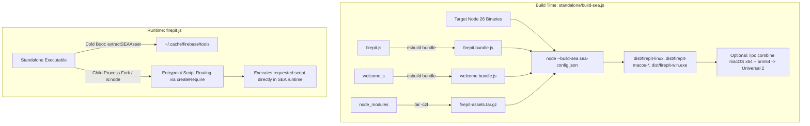

# Firepit Standalone Executable Builder

Firepit packages `firebase-tools` into native Single Executable Applications (SEAs) using Node.js 26 built-in `--build-sea` capabilities and `esbuild`.

---

## Architecture Overview



### Key Architectural Pillars

1. **Node 26 Native `--build-sea`**: Utilizes Node 26's built-in SEA compiler to inject JavaScript bundles and compressed assets into the executable without third-party binary injectors like `postject`.
2. **In-Memory Subprocess Routing**: Avoids packaging a duplicate uncompressed Node binary inside the asset tarball. When child processes are spawned via `fork()` or `is:node`, `firepit.js` intercepts script arguments at the entrypoint and resolves them using `createRequire`, saving ~40 MB download size and ~100 MB on-disk cache.
3. **Embedded Compressed Asset Tarball**: Runtime dependencies (`node_modules`) are compressed into `firepit-assets.tar.gz` and extracted on first launch to `~/.cache/firebase/tools/lib`.
4. **Native Inline Shell Polyfill**: Eliminates the heavy `shelljs` runtime dependency by implementing cross-platform filesystem operations (`mkdir`, `rm`, `cp`, `chmod`, `ln`, `ls`, `cat`, `exec`) using native Node.js APIs and `child_process.spawnSync`.
5. **Universal 2 macOS Binaries**: Supports standalone `arm64` and `x64` builds as well as multi-architecture Universal 2 binaries combined via Apple's `lipo` tool.

---

## Prerequisites

- **Node.js 26.0.0+** (Required for native `--build-sea`)
  ```bash
  nvm install 26
  nvm use 26
  ```
- **Operating System**: macOS, Linux, or Windows.
- **Xcode Command Line Tools** (macOS only, required for `codesign` and `lipo`).

---

## Quick Start (Local Development)

### 1. Install Dependencies

Inside the `standalone/` directory:

```bash
npm install
```

### 2. Build Executable for Current Machine

To quickly build a standalone binary for your current OS and architecture:

```bash
npm run build:sea -- --current-only
```

### 3. Test the Compiled Binary

```bash
# On Linux
./dist/firepit-linux --version

# On Apple Silicon macOS
./dist/firepit-macos-arm64 --version

# On Intel macOS
./dist/firepit-macos-x64 --version

# On Windows
./dist/firepit-win.exe --version
```

---

## Building All Platform Binaries

To download target Node 26 binaries and generate executables for Linux, macOS (`x64` & `arm64`), and Windows in one command:

```bash
npm run build:sea
```

Output directory: `dist/`

- `dist/firepit-linux` (Linux x86_64 ELF)
- `dist/firepit-macos-x64` (Intel Mach-O)
- `dist/firepit-macos-arm64` (Apple Silicon Mach-O)
- `dist/firepit-macos` (macOS Universal 2 binary, if built on macOS)
- `dist/firepit-win.exe` (Windows x86_64 PE)

### Customizing Node Binary or Version

You can pass custom environment variables to `build-sea.js`:

```bash
# Use a specific Node 26 executable as the compiler
NODE_BIN=/path/to/node26/bin/node node build-sea.js

# Target a specific Node version
TARGET_NODE_VERSION=26.7.0 node build-sea.js
```

---

## Creating macOS Universal 2 Binaries Manually

If you built `firepit-macos-x64` and `firepit-macos-arm64`, you can combine them into a single Universal binary on macOS using `lipo`:

```bash
# 1. Combine architectures
lipo -create -output dist/firebase-tools-macos \
  dist/firepit-macos-x64 \
  dist/firepit-macos-arm64

# 2. Ad-hoc sign the universal binary
codesign --sign - --force dist/firebase-tools-macos

# 3. Verify universal format
file dist/firebase-tools-macos
# Expected output: Mach-O universal binary with 2 architectures: [x86_64] [arm64]
```

---

## Subcommand Emulation (`is:*`)

Firepit embeds runtime scripts allowing `firebase-tools` to shell out to Node and NPM:

- **`firebase is:node [script.js | -e <code> | -v]`**:
  Executes Node.js scripts or evaluates inline expressions using the embedded SEA Node engine.
  ```bash
  ./dist/firepit-linux is:node -e "console.log(process.version)"
  ```
- **`firebase is:npm [npm args...]`**:
  Executes npm commands using the embedded npm CLI tools.
  ```bash
  ./dist/firepit-linux is:npm --version
  ```

---

## Production Release Pipeline

To run the full production release pipeline (which bundles the root `firebase-tools` package, packages headless/headful binaries, and outputs artifacts):

```bash
cd ../scripts/firepit-builder
node ./pipeline.js --package="/path/to/firebase-tools"
```

Release artifacts are written to `/tmp/firepit_artifacts/`.
